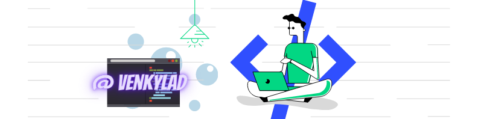

<h1 align="center">Hello, I'm Venkatesh</h1>
<h3 align="center">Professional Front-End Developer | React JS</h3>

  <a href="https://venkylad.netlify.app/" target="_blank">Portfolio</a> • 
  <a href="mailto:venkateshkonuku888@gmail.com" target="_blank">Contact</a>

---

### About Me
I am an experienced front-end developer specializing in modern web technologies and React. I focus on creating high-performance, responsive web applications with an emphasis on clean code and robust user experiences.

### Current Focus
- Developing innovative solutions in the job search ecosystem.
- Adopting the latest front-end trends to continuously improve skills.

### Current Company
- **Employer:** [Wobot AI](https://wobot.ai)  
  Collaborating with a dynamic team to build user-centric applications at scale.

